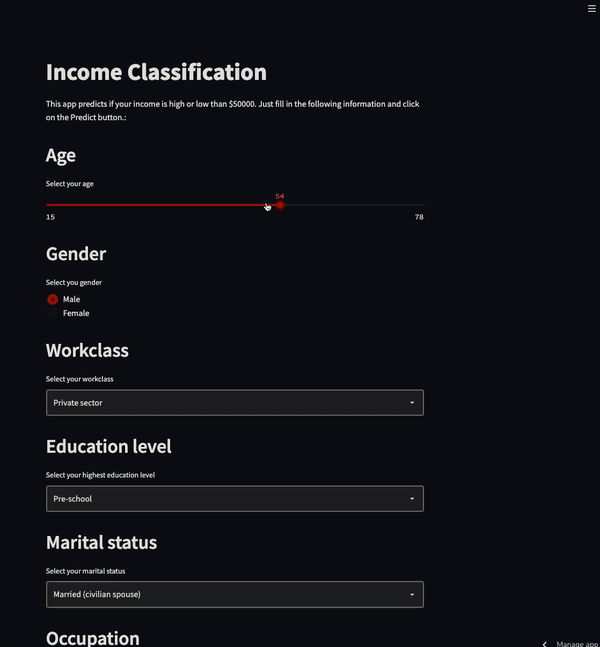

Banner [source](https://banner.godori.dev/)

# People with the highest education level, and who are either husbands or wifes makes more money

Predicting if an individual make more or less than 50K using different information about the person.


[](https://colab.research.google.com/drive/1r7d_SCO5YsUjTTPLDntvmaCykH8ga3-l)
[](https://github.com/ellerbrock/open-source-badges/)


Badge [source](https://shields.io/)

## Authors

- [@semasuka](https://www.github.com/semasuka)

## Table of Contents

- [Business problem](#Business-problem)
- [Data source](#Data-source)
- [Methods](#Methods)
- [Tech Stack](#Tech-Stack)
- [Quick glance at the results](#Quick-glance-at-the-results)
- [Lessons learned and recommendation](#Lessons-learned-and-recommendation)
- [Limitation and what can be improved](#Limitation-and-what-can-be-improved)
- [Run Locally](#Run-Locally)
- [Deployment on streamlit](#Deployment-on-streamlit)
- [App deployed on Streamlit](#App-deployed-on-Streamlit)
- [Repository structure](#Repository-structure)
- [Contribution](#Contribution)
- [License](#License)


## Business problem

This an app to predict if someone make more or less than 50k/year using different features. 
This app can be used when that information is not available or is confidential during a loan application at any financial institution or car financing application to have a better financial picture of the applicant.
## Data source

- [Kaggle Income classification](https://www.kaggle.com/lodetomasi1995/income-classification) (Main dataset)
- [GDP group dataset](https://www.kaggle.com/nitishabharathi/gdp-per-capita-all-countries) (Dataset used to enriched the main dataset with the countrie's GDP grouping)
## Methods

- Exploratory data analysis
- Bivariate analysis
- Multivarate correlation
- Feature engineering
- Feature selection
- S3 bucket model hosting
- Model deployment
## Tech Stack

- Python (refer to requirement.txt for the packages used in this project)
- Streamlit (interace for the model)
- AWS S3 (model storage)


## Quick glance at the results

Most correlated features to the target.


Confusion matrix of random forest (Best estimator with the best parameters)


ROC curve of random forest (Best estimator with the best parameters)


Top 5 models after hyper parameter tuning

| Random Forest     	| 87% 	| 
|-------------------	|-----	|
| Neural Network    	| 81% 	|   	
|-------------------	|-----	|
| KNN               	| 83% 	|   	
|-------------------	|-----	|
| Gradient Boosting 	| 90% 	|   	
|-------------------	|-----	|
| Bagging           	| 87% 	|   	
|-------------------	|-----	|

- ***The final model used is: Random forest classifier***
- ***Metrics used: Precision (87%)***
- ***Why choosing this Random forest yet Gradient boosting had 90%, well because Gradient boosting was overfitting***
- ***Why choose precision as metrics: Because a financial instituation would rather get make sure that the people the loan is given do actually make more than 50k. Even though that it means approving fewer applicants. Thus prioritizing precision over recall.***


## Lessons learned and recommendation

- Based on the analysis on this project, we found out that the education level and type of relationship are the most predictive features to determine if someone makes more or less than 50K. Other features like Capital gain, hours work and age are also usefull. The least usefull features are: their occupation and the workclass they belong to.
- Recommendation would be to focus more on the most predictive feature when looking at the applicant profile, and pay less attention on their occupation and workclass.
## Limitation and what can be improved

- Speed: since the model is stored on AWS S3, it can take some few seconds to load. Solution: cache the model with the Streamlit @st.experimental_singleton for faster reload.
- Dataset used: the dataset used is from 1990, inflation has not been taken into consideration and the countries's economies have changed since then. Solution: retrain with a more recent dataset.
- Hyperparameter tuning: I used RandomeSearchCV to save time but could be improved by couple of % with GridSearchCV.


## Run Locally
Initialize git

```bash
git init
```


Clone the project

```bash
git clone https://github.com/semasuka/Income-classification.git
```

Create a conda virtual environment and install all the packages from the requirements.txt

```bash
conda create —name <env_name> —file requirements.txt 
```

Activate the conda environment

```bash
conda activate <env_name>
```

List all the packages installed

```bash
conda list
```

Start the streamlit server locally

```bash
streamlit run income_class_st.py
```
If you are having issue with streamlit, please follow [this tutorial on how to set up streamlit](https://docs.streamlit.io/library/get-started/installation)

## Deployment on streamlit

To deploy this project on streamlit share, follow these steps:

- first, make sure you upload your files on Github, including a requirements.txt file
- go to [streamlit share](https://share.streamlit.io/)
- login with Github, Google, etc 
- click on new app button
- select the Github repo name, branch, python file with the streamlit codes
- click advanced settings, select python version 3.9 and add the secret keys if your model is stored on AWS or GCP bucket
- then save and deploy!

## App deployed on Streamlit


## Repository structure


```
├── gif_streamlit_banner                     
│   ├── gif_streamlit.gif           <- gif file used in the README.
│   ├── Income_classification.png   <- banner image used in the README.
│
├── datasets
│   ├── GDP.csv                     <- the data used to feature engineering/enriched the original data.
│   ├── test.csv                    <- the test data.
│   ├── train.csv                   <- the train data.
│   
│
├── .gitignore                      <- used to ignore certain folder and files that won't be commit to git.
│
│ 
├── income_class_profile.html       <- exported panda profile html file.
│
│ 
├── Income_Classification.ipynb     <- main python notebook where all the analysis and modeling are done.
│ 
│
├── income_class_st.py              <- file with the best model and best hyperparameter with streamlit component for rendering the interface.
│ 
│
├── README.md                       <- this readme file.
│ 
│
├── requirements.txt                <- list of all the dependancies with their versions.

```
## Contribution

Pull requests are welcome. For major changes, please open an issue first to discuss what you would like to change or contribute.

## License

MIT License

Copyright (c) 2022 Stern Semasuka

Permission is hereby granted, free of charge, to any person obtaining a copy
of this software and associated documentation files (the "Software"), to deal
in the Software without restriction, including without limitation the rights
to use, copy, modify, merge, publish, distribute, sublicense, and/or sell
copies of the Software, and to permit persons to whom the Software is
furnished to do so, subject to the following conditions:

The above copyright notice and this permission notice shall be included in all
copies or substantial portions of the Software.

THE SOFTWARE IS PROVIDED "AS IS", WITHOUT WARRANTY OF ANY KIND, EXPRESS OR
IMPLIED, INCLUDING BUT NOT LIMITED TO THE WARRANTIES OF MERCHANTABILITY,
FITNESS FOR A PARTICULAR PURPOSE AND NONINFRINGEMENT. IN NO EVENT SHALL THE
AUTHORS OR COPYRIGHT HOLDERS BE LIABLE FOR ANY CLAIM, DAMAGES OR OTHER
LIABILITY, WHETHER IN AN ACTION OF CONTRACT, TORT OR OTHERWISE, ARISING FROM,
OUT OF OR IN CONNECTION WITH THE SOFTWARE OR THE USE OR OTHER DEALINGS IN THE
SOFTWARE.

Learn more about [MIT](https://choosealicense.com/licenses/mit/) license

